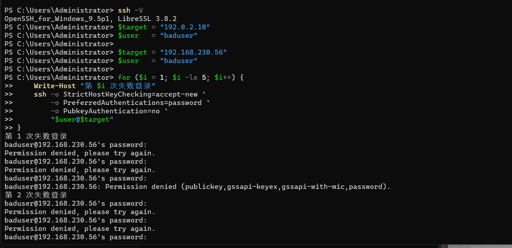
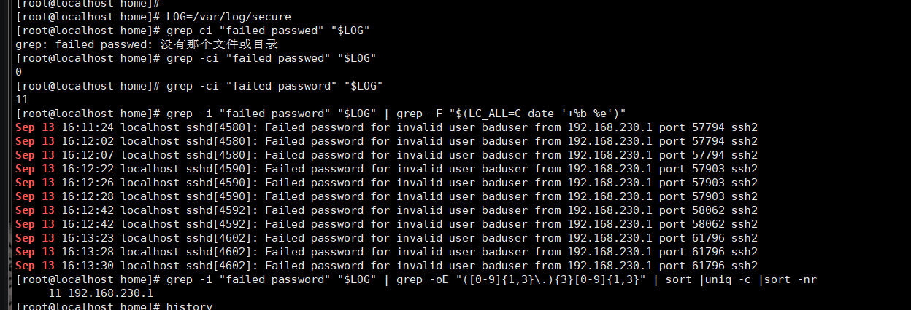
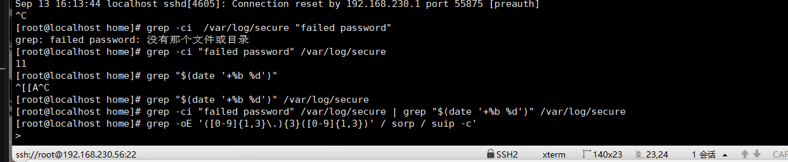
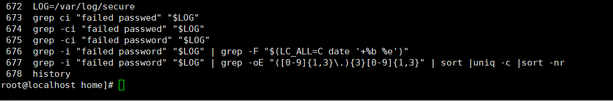

# W1-01-日志排查

## 现象 —— 我看到的坏情况（原始输出/截图贴进来）

实验背景：模仿被攻击的登录行为，通过查日志的方式找到登录了几次、什么时间、在哪里登录。



## 定位 —— 怎么一步步缩小范围（每条命令＋输出，写清"为什么用这一步"）

结论：共 11 次失败，集中在 9.13 16:12 前后，来源 192.168.230.1。

**第 1 步 · 数次数：**
`grep -ci "failed password" /var/log/secure`
为什么：先数次数＝先给事情定量级——几次可能只是手滑，十几次就值得当攻击处理；先知道总量，后面查时间、来源才有范围感，不会被单条记录带偏。

**第 2 步 · 查时间：**
`grep -F "$(LC_ALL=C date '+%b %e')" /var/log/secure`
为什么：中文环境下 date 输出中文月份、和日志里的英文月份对不上，grep 抓不到；加 LC_ALL=C 强制输出英文后才对得上。（查资料）

**第 3 步 · 提来源：**
`grep -oE "([0-9]{1,3}\.){3}[0-9]{1,3}" /var/log/secure`
为什么：我要的只是每行里的 IP——`-o` 只输出匹配到的那一小段（不把整行带出来）；`( ) { }` 这类写法在普通 grep 里要逐个加反斜杠转义，`-E` 让我能直接写。

（查完资料后跑通的版本）

## 根因 —— 到底什么坏了（争取一句话说清）

不是入侵——是我在 Windows 上故意输错密码做的自测。登录失败的直接原因＝密码错误。

## 复盘 —— 下次遇同类怎么更快（≥3 行，要具体到命令）

```
LOG=/var/log/secure
grep -ci "failed password" "$LOG"
grep -i "failed password" "$LOG" | grep -F "$(LC_ALL=C date '+%b %e')"
grep -i "failed password" "$LOG" | grep -oE "([0-9]{1,3}\.){3}[0-9]{1,3}" | sort | uniq -c | sort -nr
```

写一个脚本用来排查这个【待 M1 后段兑现】

> 自评：查资料（哪些见上文）｜卡住：查时间和查 IP，后面查资料解决了｜第 1、3 步「为什么」＝导师示范稿（口述过关后转正）

## 附录·初版踩坑（存档）


这是模仿登录失败的过程。


第一版出现很多错误，未查资料。我的思路是先用 grep -ci 查询有几次错误登录信息 → 再用 grep -oE 找到并打印试图登录失败的 IP；没写通的原因＝没有熟练掌握 grep 的用法。


查资料前的一版草稿（当时写不通的那版）。

查资料解决了：查时间要加 LC_ALL，不然查的是中文所以搜不到；查 IP 的用法是搜来的。
