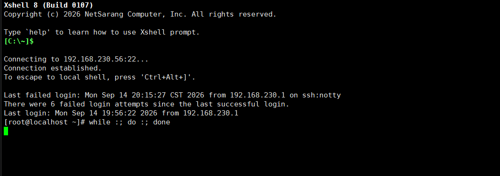
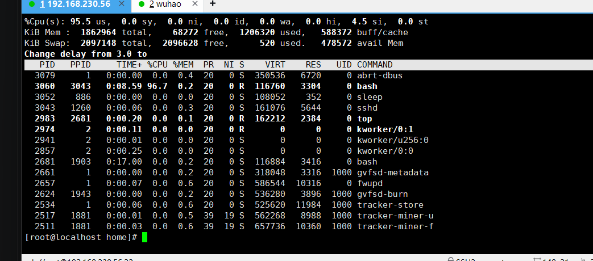
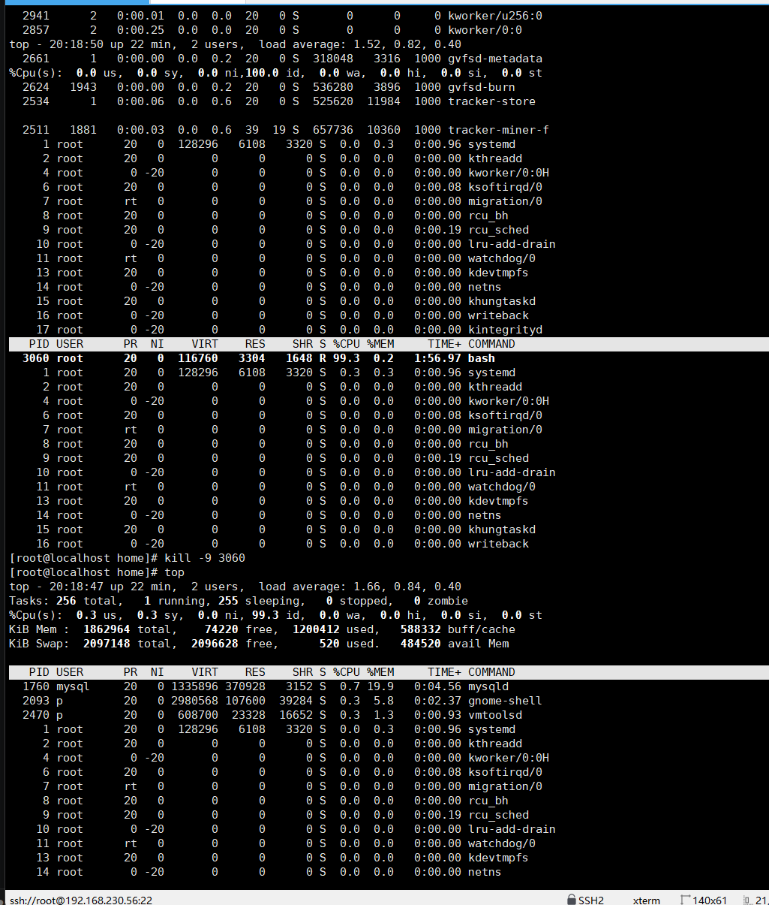

# W1-02-资源类

## 现象 —— 我看到的坏情况（原始输出/截图贴进来）

死循环指令：

```bash
while :; do :; done
```

我看到的情况如图：





## 定位 —— 怎么一步步缩小范围（每条命令＋输出，写清"为什么用这一步"）

1. `top`：找占用 CPU 的元凶（按 P 以 CPU 排行）
2. `kill -9 <PID>`：强制杀死进程（PID 从 top 输出里抄）
3. `top`：再看一眼，确认进程被杀死、CPU 回落




## 根因 —— 到底什么坏了（争取一句话说清）

我在另一个 SSH 里写了一个死循环，把 CPU 占满了。

## 复盘 —— 下次遇同类怎么更快（≥3 行，要具体到命令）

```bash
top              # 进去以后按 P 以 CPU 排行
kill -9 <PID>    # 强制杀死进程（注意：kill 吃的是 PID）
top              # 再次查看 CPU 占用率，确认回落
```

> 自评：查资料——不会写死循环（只知道 `while [ 1 -eq 1 ]` 这种写法），后面查资料解决。
