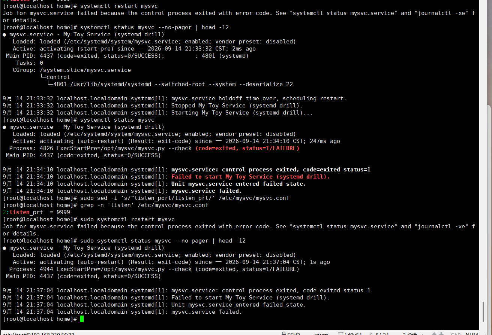
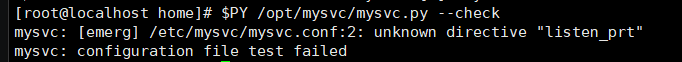
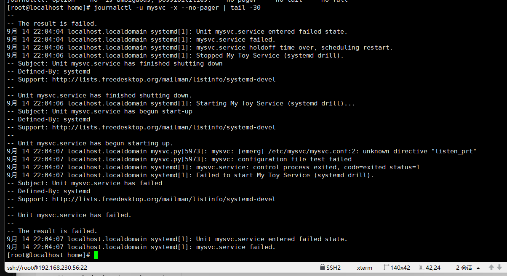
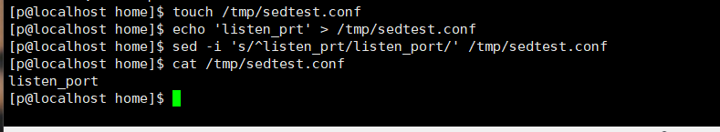
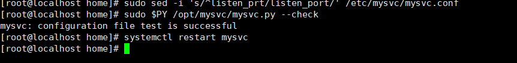

# W1-03-服务类

## 现象 —— 我看到的坏情况（原始输出/截图贴进来）



## 定位 —— 怎么一步步缩小范围（每条命令＋输出，写清"为什么用这一步"）



`command -v python3` —— 看 python3 指向哪；`python3 /opt/mysvc/mysvc.py --check` —— 跑应用自检



`journalctl -u mysvc -x --no-pager | tail -30` —— 查看日志，看它为什么错

`sed -i 's/^listen_prt/listen_port/' /etc/mysvc/mysvc.conf` —— 把配置改回来




`command -v python3` —— 再确认；`python3 /opt/mysvc/mysvc.py --check` —— 检查是否修复

`systemctl restart mysvc` —— 重启服务

## 根因 —— 到底什么坏了（争取一句话说清）

我把配置文件改了一个字母（listen_port → listen_prt），mysvc 进程起不来了。

## 复盘 —— 下次遇同类怎么更快（≥3 行，要具体到命令）

分三步走：定位 → 解决 → 检验。

```bash
command -v python3                                        # 看 python3 指向哪
python3 /opt/mysvc/mysvc.py --check                       # 自检
sed -i 's/^listen_prt/listen_port/' /etc/mysvc/mysvc.conf # 修回配置
python3 /opt/mysvc/mysvc.py --check                       # 再自检
```

> 自评：
> - 查资料：① `sed -i` 原地修改文件——一般要先备份；② `command -v python3` 确认解释器、`python3 /opt/mysvc/mysvc.py --check` 做配置自检；③ 服务坏了怎么查——用 `journalctl -u 服务名` 看日志；④ `sed -i 's/旧内容/新内容/' 被修改文件` 的语法。
> - 卡住：不会破坏 mysvc、不会定位哪里坏了——后面查资料解决了。
