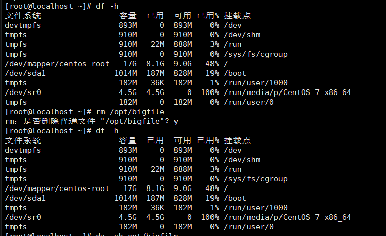
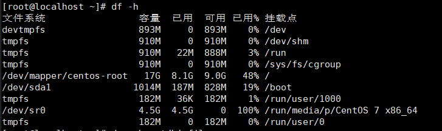
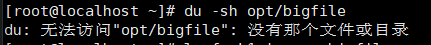
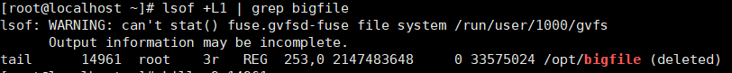
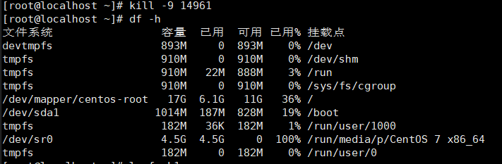

# W2-01-磁盘类
## 现象 —— 我看到的坏情况（原始输出/截图贴进来）
删除文件后还是磁盘空间不返还
## 定位 —— 怎么一步步缩小范围（每条命令＋输出，写清"为什么用这一步"）
df -h  看看磁盘空间情况
du -sh /opt/bigfile  找不到这个文件了找找看文件有没有被删除
lsof +L1 /opt/bigfile  找到被删除但是还在打开的文件  文件是被删了但是空间没释放说明文件还在被打开
kill <PID>    杀死还在打开的文件的进程  因为要杀死进程后才能释放空间
df -h 看看空间被释放没 空间被释放了
## 根因 —— 到底什么坏了（争取一句话说清）
把文件删了但是还有进程打开着文件  所以空间没有释放
## 复盘 —— 下次遇同类怎么更快（≥3 行，要具体到命令）
df -h   看空间释放没有
du -sh  查找文件有没有被删除
lsof +L1  找到还在打开文件的进程 
kill    杀死进程
df -h  看空间释放没

> 自评：独立 / 查资料（列出哪些） / 卡住（卡在哪、后来怎么解决）
>查资料  lsof +L1  du -s  fallocate -l
>不会给磁盘加空占内容的文件  查资料  不会查找已删除的文件  不会找文件被删除后还占用的进程 都是查资料解决的

