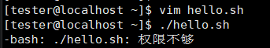
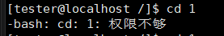
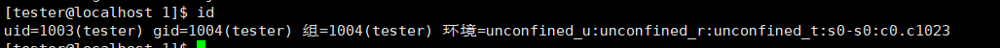
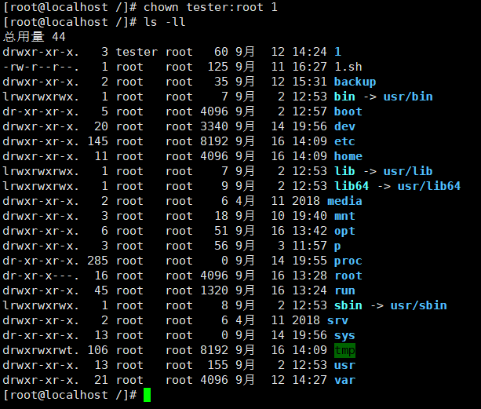

# W2-02-权限类
## 现象 —— 我看到的坏情况（原始输出/截图贴进来）
 
## 定位 —— 怎么一步步缩小范围（每条命令＋输出，写清"为什么用这一步"）
普通用户所属组
  把所属人改成tester 所属组root

## 根因 —— 到底什么坏了（争取一句话说清）
tester没有对目录的x权限，也没有对hello.sh的x权限
## 复盘 —— 下次遇同类怎么更快（≥3 行，要具体到命令）
chmod 直接改文件的权限
chown 改所属人和组
useradd -m 创建新用户
> 自评：独立 / 查资料（列出哪些） / 卡住（卡在哪、后来怎么解决）
> 独立