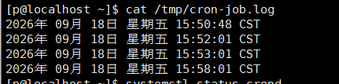
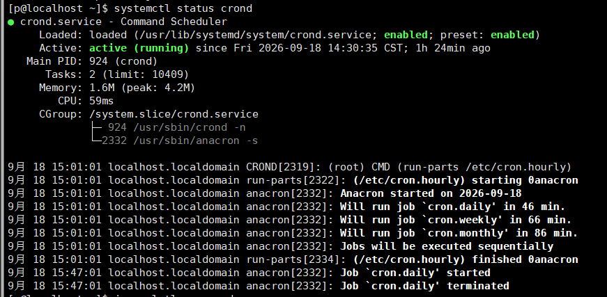
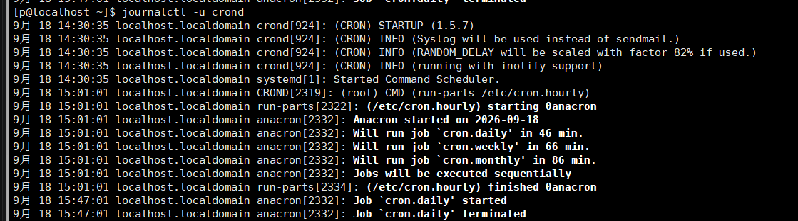
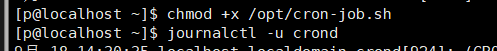

# W2-03-定时任务类
## 现象 —— 我看到的坏情况（原始输出/截图贴进来）
15:52:01执行定时任务但在53后就没有执行定时任务了
## 定位 —— 怎么一步步缩小范围（每条命令＋输出，写清"为什么用这一步"）
查看crond服务有没有启动
 查看crond的日志看看定时任务有没有被修改
两个都没有动的话，可能是没有执行权限——chmod +x 脚本
实测 58 分改完脚本后，定时任务又重新执行
## 根因 —— 到底什么坏了（争取一句话说清）
我修改了脚本的执行权限   定时任务的脚本没有执行权限所以无法执行 
## 复盘 —— 下次遇同类怎么更快（≥3 行，要具体到命令）
systemctl status crond 查看服务是否启动
journalctl -u crond 查看服务的日志 看是否有人修改定时任务
chmod +x      修改脚本的权限

> 自评：独立 / 查资料（列出哪些） / 卡住（卡在哪、后来怎么解决）
> 独立