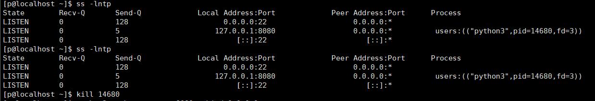

# W2-04-网络类
## 现象 —— 我看到的坏情况（原始输出/截图贴进来）
用本机的ip连接不上
## 定位 —— 怎么一步步缩小范围（每条命令＋输出，写清"为什么用这一步"）
ss -lntp 查看8080绑在哪个ip上
kill <PID> 杀死占用8080的进程
python3 -m http.server 8080 --bind 0.0.0.0 重新绑定ip 
curl 192.168.230.21:8080 用本机检查是否可以连接连接成功
## 根因 —— 到底什么坏了（争取一句话说清）
进程的ip被我修改成127.0.0.1  只能127.0.0.1连入进程
## 复盘 —— 下次遇同类怎么更快（≥3 行，要具体到命令）
ss -lntp查看是否有进程占用端口
kill 杀死进程
python3 -m http.server 8080 --bind 0.0.0.0 重新给端口绑定ip
curl 192.168.230.21:8080  测试可以连入没

> 自评：独立 / 查资料（列出哪些） / 卡住（卡在哪、后来怎么解决）
> 查资料   python3 -m http.server 8080 --bind 0.0.0.0                          curl 192.168.230.21:8080  
> 有些不懂这个实验需要干什么  查资料