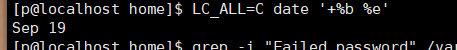
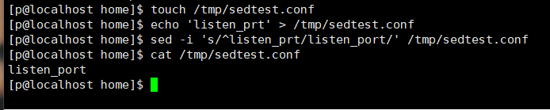

# W2-盲抽卷（收官关 · 09-19 发）

> 直接在本文件每题「**答：**」下方写，不用另建文件、别删题面。
> **规则**：① 闭卷——不翻自己的手册、不翻《知识点拓展》、不搜索；② 可以进 VM 敲命令验证；③ 每题「命令 ＋ 一句说明」，不会就标 **冷**，别硬编；④ 单题卡 2 分钟就往下走；⑤ 写完 Ctrl+S 保存，喊「交盲抽」。

---

## 1. 服务器疑似被人试密码。要跟人说清三件事——试了多少次 / 集中在什么时候 / 从哪个 IP 来。报出你的命令组合。

**答：**grep -ci "Failed password" /var/log/secure 查多少次
 grep -i "Failed password" /var/log/secure | grep -e "$(LC_ALL=C date '+%b %e') "  查时间
grep -oE "([0-9]{1,3}\.){3}[0-9]{1,3} " /var/log/secure 查ip

---

## 2. 你按日期筛日志：`grep "$(date '+%b %e')" /var/log/secure`——一条都搜不到，但日志里明明有那天的记录。为什么？怎么改？

**答：**
`grep "$(date '+%b %e')" /var/log/secure`—>`grep "$(LC_ALL=C date '+%b %e')" /var/log/secure` 直接写date给的是中文但是日志记录的已英文的所以要加LC_ALL把中文改成英文

---

## 3. 机器变卡。把「揪元凶 → 处置 → 收尾」走一遍：每步一条命令 ＋ 一句说明。

**答：**
top 进去以后按 p已cpu占用率排行
找到占用cpu的程序后kill -9 杀死进程
top再看cpu占用是否回落

---

## 4. mysvc 服务起不来（active: failed）。先看状态、再看它为什么挂——两条命令分别是什么？各给你什么信息？

**答：**
systemctl status mysvc 查看服务是否是启动的
journalctl -u mysvc 查看服务日志找为什么挂

---

## 5. 配置里 `listen_port` 被改坏成了 `listen_prt`——写命令改回去。改完、重启前还差哪一步？为什么？

**答：**  
sed -i 's/listen_prt/listen_port/' /文件 
mysvc.py --check应用自检 再次检查应用是否完整
systemctl status 服务   

---

## 6. `df` 说盘满，`du` 翻遍目录找不到大文件。发生了什么？用什么命令揪出「占着空间不还」的凶手？处理完怎么确认？

**答：**
rm删除了文件但是还有进程占用   lsof +L1找出占用文件的进程  kill杀死进程  df -h 确认空间是否回落

---

## 7. 一个目录：`ls` 能看到文件名，但 `cd` 进不去、里面的文件也读不了。缺哪个权限位？给一条修复命令。

**答：**
chmod o+x 目录 这样其他人就可以执行cd进去看目录

---

## 8. 脚本在终端跑得好好的，挂进 `crontab` 就是不动。按顺序排查——每处配一条命令。顺带半句：动 crontab 之前先做一个什么动作保命？

**答：**
cron 环境 PATH 极简
crontab -l > tmp/cron.bak 备份定时任务
crondtab -l 查看定时任务是不是还存在
systemctl status crond 看定时任务的服务是否正常
journalctl -u crond 如果是服务坏了就看日子修复
绝对路径／脚本里补 PATH
在检查是否有执行权限

---

## 9. 本机 `curl 127.0.0.1:8080` 通，别人的电脑连不上。第一条命令看什么、看哪一列？修复动作是什么？

**答：**
ss -lntp 查看8080前面的是不是挂着别的ip
如果挂了的话kill pid 杀死后才能重新绑定
python3 -m http.server 8080 --bind 0.0.0.0  重新把端口挂在0.0.0.0

---

## 10. 快问：想知道 8080 端口被谁占着——一条命令。

**答：**
ss -lntp | grep "8080"

---

## 口述（抽签：W2-01 磁盘类）

> 做法：翻开 `W2-01-磁盘类.md` 看一遍 → 合上 → 出声讲 30–60 秒 → 把讲出来的内容写在这里（打字口语版，像对着人说话，别照抄原文）。

**口述稿：**
磁盘爆满rm删除后还是没返回空间 大部分原因是因为还有进程在占用文件 先df -h查看磁盘的占用情况 du -sh 文件地址 看看能不能找到 找不到的话在lsof +L1看看文件在不在被占用 一般就能找到文件被哪个进程占用kill 进程号  df -h看空间是否返还

